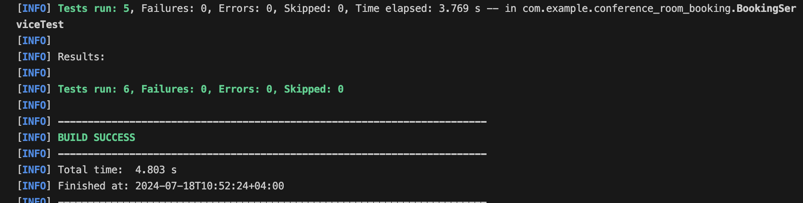

# Conference Room Booking API

## Overview

This is a RESTful API for booking conference rooms. The API allows users to book conference rooms and check available rooms within a specified time range.

## Technologies Used

- Java 17
- Spring Boot
- Maven
- H2 In-Memory Database
- JUnit 5
- Docker
- Swagger

## How to Run the Application

### Prerequisites

- Docker
- Maven

### Build the Application

```bash
mvn clean install
```

### Run the Application using Docker

```
docker-compose up --build
```

### Run the Application Locally

```
mvn spring-boot:run
```

### Access Swagger UI

Open your browser and go to http://localhost:8080/swagger-ui.html

### Run Test Cases

```
mvn test
```

#### Test Cases Result 


### Access the H2 Database

- Open your browser and go to http://localhost:8080/h2-console

- Use the JDBC URL: `jdbc:h2:mem:testdb`, and the username: `sa` with password: `password` to connect.

### API Endpoints

#### Book a Room

- URL: `http://localhost:8080/api/bookings`

- Method: `POST`

- Request Body:

  ```json
  {
    "startTime": "10:00",
    "endTime": "11:00",
    "numberOfPeople": 5
  }
  ```

- Response:
  ```json
  {
    "id": 1,
    "conferenceRoomName": "Beauty",
    "startTime": "10:00",
    "endTime": "11:00",
    "numberOfPeople": 5
  }
  ```

#### Get Available Rooms

- URL: `http://localhost:8080/api/bookings/available`

- Method: `GET`

- Query Parameters:
  - `startTime` : Start time in `HH:mm` format
  - `endTime` : End time in `HH:mm` format

Response:

```json
[
  {
    "name": "Beauty",
    "capacity": 10
  },
  {
    "name": "Amaze",
    "capacity": 5
  },
  {
    "name": "Inspire",
    "capacity": 15
  },
  {
    "name": "Strive",
    "capacity": 20
  }
]
```
